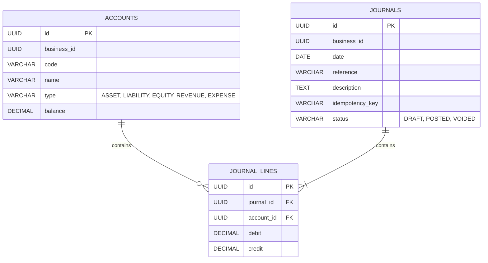

# Database

DUITGOO utilizes **PostgreSQL** as the primary datastore for all microservices.

## Architecture & Rules
1. **Isolated Schemas**: Every microservice owns its own database (e.g., `identity_db`, `accounting_db`, `business_db`). **Services must never share database tables.**
2. **Migrations**: Managed by `sqlx-cli`. Migrations are located within the `migrations/` folder of each microservice. To prevent tracking collisions when applying migrations to a single shared local development database, timestamp sequencing must be uniquely staggered (e.g., by day) across microservices.
3. **Data Types**: All monetary values must use `DECIMAL(18, 2)`.

## Example ERD (Accounting Service)
The Accounting Service is the core of the financial platform.



## Setup and Migrations
Local development database creation and migrations are automated via the `Makefile`.
```bash
make migrate
```
*Note: Seeding logic is currently not implemented in the repository.*
